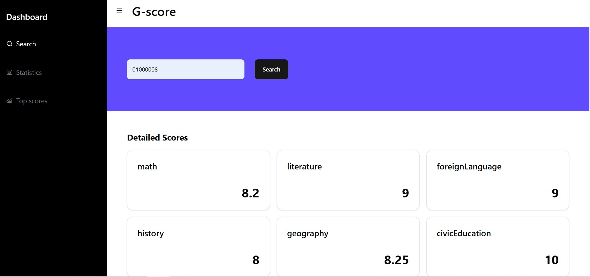

# G-Score Demo

A web application for processing and analyzing high school exam scores from the `diem_thi_thpt_2024.csv` dataset. It includes features for score lookup, statistical reporting, and visualization, built with Vite + ReactJS and Spring Boot.

## Table of Contents

- [Features](#features)
- [Tech Stack](#tech-stack)
- [Setup Instructions](#setup-instructions)
- [Usage](#usage)

## Features

- **Data Conversion**: Imports `diem_thi_thpt_2024.csv` into a database using Spring Boot's JPA/Hibernate with Flyway migrations and a custom data loader.
- **Score Lookup**: Allows users to retrieve exam scores by entering a registration number.
- **Score Report**: Categorizes scores into four levels:
  - ≥ 8 points
  - 6 to < 8 points
  - 4 to < 6 points
  - < 4 points
- **Statistics Visualization**: Displays the number of students in each score level by subject using interactive charts.
- **Top 10 Students**: Lists the top 10 students in Group A, A1, B based on total scores.

- **Responsive Design**: Ensures a seamless experience across desktops, tablets, and mobile devices using Tailwind CSS.

## Tech Stack

### Frontend

- **Framework**: ReactJS with Vite for fast development and builds
- **Styling**: Tailwind CSS for responsive design
- **UI Library**: Shadcn/ui for accessible, customizable, and responsive components

### Backend

- **Framework**: Spring Boot (Java)
- **Programming**: Object-Oriented Programming (OOP) for subject management
- **ORM**: Spring Data JPA with Hibernate for database interactions
- **Database**: PostgreSQL

### Deployment

- **Frontend**: Vercel - [URL](https://g-score-demo-385x.vercel.app)
- **Backend**: Render - [URL](https://g-score-demo.onrender.com/api/v1/healthcheck)
- **Database**: Supabase

## Setup Instructions

### Steps

1. **Clone the Repository**:

   ```bash
   git clone https://github.com/hphuc0324/G-score-demo.git
   cd G-score-demo
   ```

2. **Frontend Setup**:

   Configure an environment file in `frontend/src`:

   ```properties
   VITE_API_END_POINT=your_end_point
   ```

   Install packages:

   ```bash
   cd frontend
   npm install
   npm run dev
   ```

   The frontend will run on `http://localhost:5173` (default Vite port).

3. **Backend Setup**:

   ```bash
   cd backend
   ```

   Configure environment variables in `backend/src/main/resources/application.yml`:

   ````properties
   server:
    port: 8080
   spring:
    datasource:
       url: ${SPRING_DATASOURCE_URL}
       username: postgres
       password: ${SPRING_DATASOURCE_PASSWORD}
       driver-class-name: org.postgresql.Driver
    flyway:
       enabled: true
       baseline-on-migrate: true
       baseline-version: 1
    jpa:
       show-sql: true
       hibernate:
          ddl-auto: none
          naming:
             physical-strategy: org.hibernate.boot.model.naming.PhysicalNamingStrategyStandardImpl
       properties:
          hibernate:
          dialect: org.hibernate.dialect.PostgreSQLDialect
          format_sql: true
          default_schema: public

    cors:
    allowed-origins: ${SPRING_CORS_ALLOWED_ORIGINS}

    api:
    prefix: api/v1
       ```
       - Run migrations and build the application:
       ```bash
       mvn clean install
       ```
       - Start the backend server:
       ```bash
       mvn spring-boot:run
   ````

   The backend API will be available at `http://localhost:8080`.

4. **Database Setup**:
   - Ensure PostgreSQL is running and the `G-Score` database is created.
   - Flyway migrations will create tables for students, subjects, and scores.
   - A custom data loader (seeder) will populate the database from `diem_thi_thpt_2024.csv` on application startup.

## Usage

- **Score Lookup**: Enter a registration number on the homepage to view a student's scores.

  

- **Statistics**: View charts in the "Statistics" section for subject-wise score analysis.

  

- **Top 10 Group A**: Check the "Top Students" section for the top 10 students in Math, Physics, and Chemistry.

  

- **Responsive**: Available on mobile devices.

  
  
